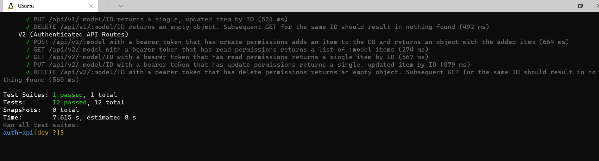
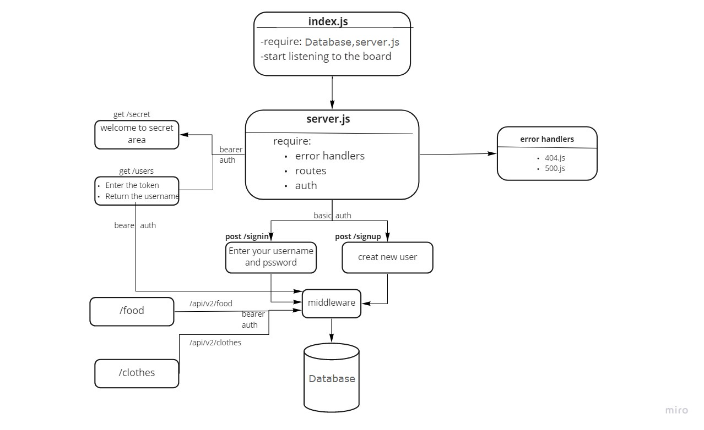

**auth-api**

**Author: Amr Nzzal**

It is a server combines between api-server and auth-server, but controlling access at a more granular level is vital to creating a scalable system. In this lab, you will implement Role Based Access Control (RBAC) using an Access Control List (ACL), allowing to not only restrict access to routes for valid users, but also based on the individual permissions we give each user.

**How to Build?**

Create a new repo and go to action then select node.js workflow for CI.

Clone it to your local machine and create Package.json and add server.js and index.js.

Install the packages.

follow the design pattern in the repo and write your own code.

**Links and Resources:**

# [Heroku](https://amr-auth-api.herokuapp.com/)

# [Github Actions](https://github.com/amr88nzzal/auth-api/actions)

# [pull request](https://github.com/khalidsy90/auth-api/pull/1)

**Setup**

**Clone the repo**
    clone the repo to local storage and run the commands below:

    * `npm init -y`
    * `npm i` 

**.env file :**

- PORT=3000
- DATABASE_URL=postgres://localhost:5432/auth_api
- SECRET=amr-nzzal--amr-nzzal

* **Endpoints:**
   *  for create (/signup)
   *  for login (/signin)
   *  for get (/users)
   *  for create(/api/v1/food||clothes)
   *  for update(/api/v1/food||clothes)
   *  for delete(/api/v1/food||clothes)
---

**Testing**

 You can test the project by type:

    * npm run test

 You should get something like :

---

**UML/Application**

